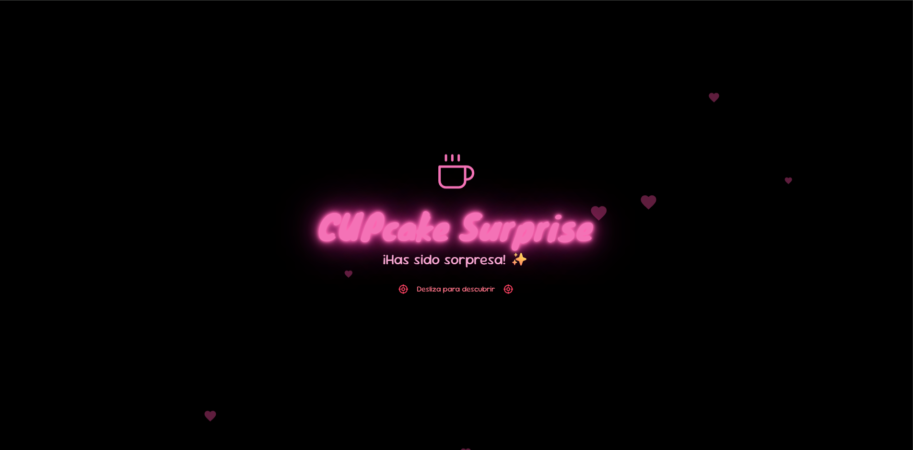

# Cupcake Surprise 🧁

Landing page "Dark Romance Neon" para sorpresa de cupcake con mensaje personalizado.

## Preview



## Características

- 🎨 Estilo Dark Romance Neon (fondo negro, néon pink/vino)
- ✨ Animaciones GSAP + AOS
- 📱 Diseño responsive
- 💬 Botón WhatsApp para responder
- 🔤 Fuentes: Knewave + Sour Gummy

## Requisitos

- Node.js 18+
- pnpm (o npm/yarn)

## Instalación

```bash
# Instalar dependencias
pnpm install

# Ejecutar en desarrollo
pnpm run dev
```

## Configuración

### Mensaje personalizado

Edita el mensaje en `app/app.vue`:

```javascript
const mensajeCompleto = 'Tu mensaje aquí...'
```

### Número de WhatsApp

Edita el enlace en `app/app.vue` (footer):

```html
href="https://wa.me/?text=¡Me encantó la sorpresa!"
```

Cambia por tu número:
```html
href="https://wa.me/1234567890?text=Tu mensaje"
```

### Fecha

Edita la fecha en `app/app.vue` (footer):
```html
17 de Marzo, 2026
```

### Colores

Edita los colores en `app/assets/css/main.css`:

```css
:root {
  --neon-pink: #ff69b4;
  --neon-wine: #c71585;
}
```

## Scripts

| Comando | Descripción |
|---------|-------------|
| `pnpm dev` | Servidor de desarrollo |
| `pnpm build` | Build para producción |
| `pnpm generate` | Generar sitio estático |
| `pnpm preview` | Previsualizar build |

## Estructura

```
cupcake-surprise/
├── app/
│   ├── app.vue           # Componente principal
│   └── assets/css/
│       └── main.css      # Estilos personalizados
├── nuxt.config.ts        # Configuración Nuxt
├── tailwind.config.ts    # Configuración Tailwind
└── package.json
```

## Deploy

### Vercel (Recomendado)

```bash
# Instalar Vercel CLI
pnpm add -g vercel

# Deploy
vercel
```

O conecta el repositorio en [vercel.com](https://vercel.com)

### Netlify

1. Conecta el repositorio en [netlify.com](https://netlify.com)
2. Build command: `pnpm generate`
3. Publish directory: `dist`

## Generar QR Code

Una vez deployado, genera el QR en:
- https://qr-code-generator.com
- https://goqr.me

Apunta a la URL del proyecto deployado.

## Tecnologías

- [Nuxt 4](https://nuxt.com) - Framework Vue
- [TailwindCSS](https://tailwindcss.com) - Estilos
- [GSAP](https://greensock.com/gsap/) - Animaciones
- [AOS](https://michalsnik.github.io/aos/) - Animaciones scroll

## Licencia

Privado - Solo para uso personal
